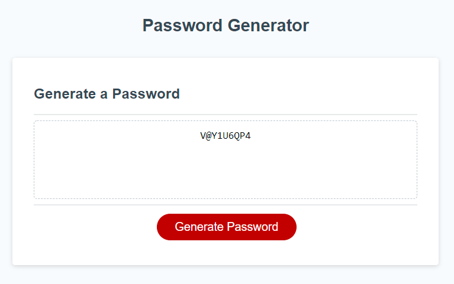

# MyPass Generator

This program can be used to generate a password based on user-inputted criteria.

## Usage

Click the "Generate Password" button and follow the on-screen prompts.

Access the password generator from [https://chardmuffin.github.io/myPass-generator/](https://chardmuffin.github.io/myPass-generator/)

## License
[MIT](https://choosealicense.com/licenses/mit/)